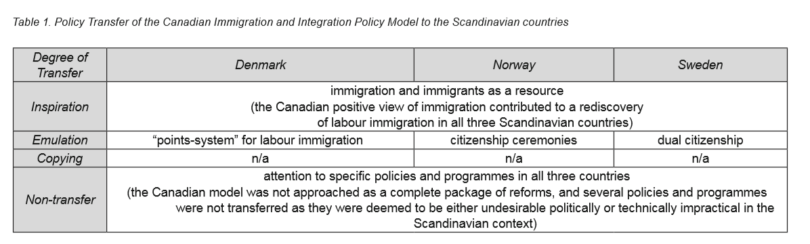
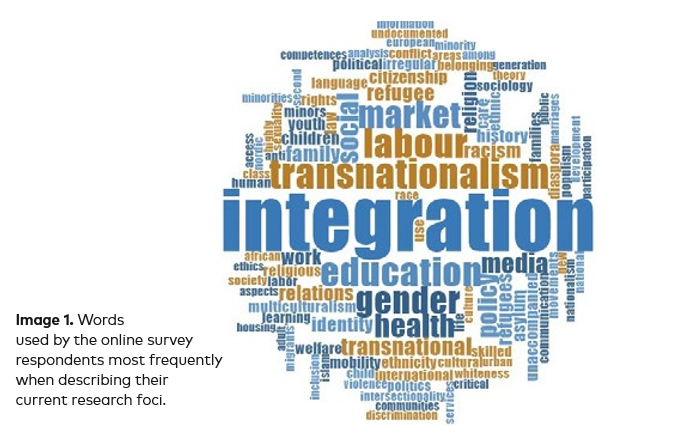
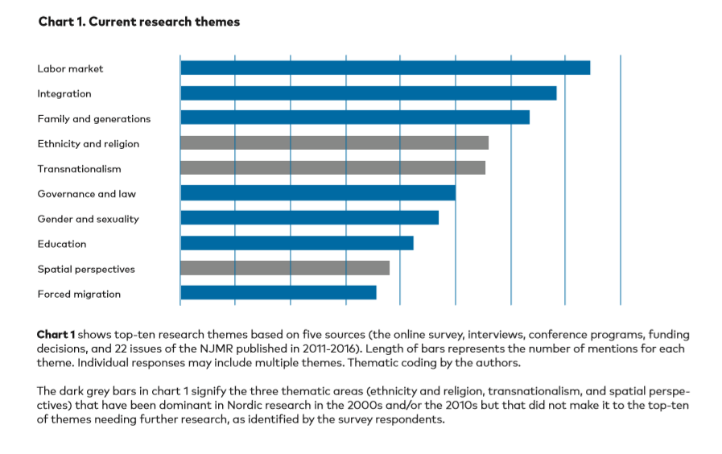
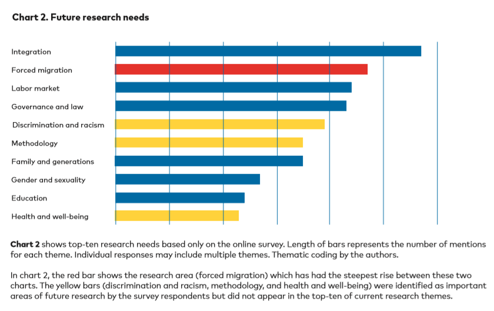

# Migration history of Norway and Sweden

<!-- TOC titleSize:2 tabSpaces:2 depthFrom:1 depthTo:6 withLinks:1 updateOnSave:1 orderedList:0 skip:0 title:1 charForUnorderedList:* -->
## Table of Contents
* [Migration history of Norway and Sweden](#migration-history-of-norway-and-sweden)
* [Policy](#policy)
  * [Ugland 2014](#ugland-2014)
    * [Denmark](#denmark)
    * [Norway](#norway)
      * [Norwegian diversion: DNA testing for family reunions](#norwegian-diversion-dna-testing-for-family-reunions)
    * [Sweden](#sweden)
* [Norway](#norway)
  * [Encyclopedia entry: Kjelstadli 2013](#encyclopedia-entry-kjelstadli-2013)
    * [Synposis of Labour migration](#synposis-of-labour-migration)
    * [Refugees in Norway](#refugees-in-norway)
    * [Norway immigrant stats](#norway-immigrant-stats)
* [Sweden](#sweden)
  * [Wikipedia on Sweden demography](#wikipedia-on-sweden-demography)
    * [Migrant crisis sweden (2008 - present)](#migrant-crisis-sweden-2008---present)
  * [Sweden, migration from 19th Century to Present [Grönberg 2013]](#sweden-migration-from-19th-century-to-present-grönberg-2013)
    * [Refugess in Sweden](#refugess-in-sweden)
    * [Politics](#politics)
  * [Nordforsk policy paper on migration (to be moved)](#nordforsk-policy-paper-on-migration-to-be-moved)
    * [Paper summary](#paper-summary)
<!-- /TOC -->

# Policy

##  Ugland 2014

> Ugland, Trygve. 2014. ‘Canada as an Inspirational Model: Reforming Scandinavian Immigration and Integration Policies’. Nordic Journal of Migration Research 4 (3): 144. https://doi.org/10.2478/njmr-2014-0016.

**Summary:** Compares policy for a period 2000-2012 from Denmark, Norway and Sweden to Canada. We are just scoping for the policy parts. Focuses variously on family reunification, dual citizenship, access to welfare and other interesting tidbits. In general Canada provided an inspiration but not a direct copy of changes to policy during this period.

**Note** I guess this speaks to the context of the NordF call and migration scoping paper: the Nordic countries are trying to learn from more countries that are seen as more traditionally migrant accepting. Despite the fact that Nordic countries like Sweden are already multiethnic and those countries like the UK are also seeking policy solutions to the same issues spurred by the same events (refugees, EU expansion).

**Note:** It seems like the welfare state and immigration is the context for this immigration policy interest. Lots of interesting bits about this in the first section.

Why Canada:

> Although many countries and models have been devoted attention, this article focuses on the role the Canadian immigration and integration policy model played in the Scandinavian reform process in the period from 2000 to 2012, which has been referred to as a “reassessment phase” in the history of Scandinavian immigration and integration policies (Brochmann & Hagelund 2012). The challenges posed by increasing immigration and ethnocultural diversity are a major concern for governments across the world, and a variety of apparent immigration and integration policy solutions exist internationally. Canada has one of the highest levels of foreign-born populations in the world, and currently admits more immigrants annually relative to the size of its population than most countries.

Also Canada's welfare system makes parallels with Nordic Countries (especially Norway) attractive (p.148). Note that eventually Norway diverges with policy compared to Canada:

> .. Canada’s combination of an open and accommodating approach to immigration and increasing ethnic diversity with a comprehensive welfare state system has also been used to justify the attention devoted to the Canadian model88. A representative from the Welfare and Migration Committee [*Norway*; my emphasis] highlighted this aspect and referred to Canada as an **“interesting contrast case” to Norway because the Canadian and Norwegian immigration policies differ substantially while the two countries share a commitment to the welfare state** (Interview 6, Oslo, 13 December 2010)

Below is wierdly useful figure from the paper synopsisying major points of policy convergence:

**Summary of Canada's system:**

Points based economic sponsorship (don't know how that differs from UK)
> The Canadian model can be summarised through two main characteristics. First, and with respect to immigration control, Canada has adopted a selective approach, which actively aims to attract economic immigrants. **Currently, this group, including spouses and dependents, constitutes nearly two-thirds of the migrants coming to Canada each year. The family stream comprises approximately 25 percent, while refugees and others admitted for humanitarian reasons represent somewhere between 10 and 15 percent of immigrants coming to Canada each year (OECD 2012b)**. The “points” and “sponsorship” systems are central components of the Canadian model. While economic immigrants are selected through a points-system that grants priority to those most likely able to **enter the Canadian labour force by virtue of their age, education, work experience, and language skills**, **family immigrants who wish to enter Canada to be reunited with their families require sponsors who will
commit to supporting them economically for a significant period of time**. Further, Canada also makes use of private sponsorships in order to provide financial and emotional support for arriving refugees.

Second is probably policies and rhetoric that creates less divide between migrant and natives:

> Second, Canada’s multiculturalist citizenship represents a key element in the approach to immigrant integration, where multiculturalism refers to a policy of recognising diversity within public institutions and celebrating it as an important dimension of collective life and collective identity (Kymlicka 2007c). Canada was the first country to adopt an official public policy of recognising and accommodating ethno-cultural diversity through a parliamentary statement in 1971. This policy was subsequently enshrined in law in the Canadian Multiculturalism Act of 1988 and given constitutional recognition in section 27 of the Constitution. Canada followed up on this constitutional commitment with the world’s strongest multicultural policies (Banting & Kymlicka 2006). **Programmes supported under Canada’s multiculturalism policy include, to mention a few, the allowance of dual citizenship; public funding for ethnic group organisations and activities such as ethnic festivals; and exemptions from dress codes in certain areas.** The Canadian multiculturalist approach is built on a conception of integration in which it is expected that immigrants will visibly and proudly express their ethnic identity and that accepts an obligation on the part of public institutions to accommodate these ethnic identities (Kymlicka 2007a). In addition to measures directly earmarked for the immigrant population, **indirect integration policy measures exist in the form of general welfare policies. Immigrants have, with few exceptions, immediate and undifferentiated access to social benefits and are not confronted with long residency requirements (Banting 2010)**.

**Note** Not sure how big a deal some of those policies are. The unrestricted access to welfare is however a biggie potentially. Apparently they have promoted their model (see below)

> The Canadian government has actively promoted the Canadian model abroad (Abu-Laban & Gabriel 2002; Kymlicka 2004).

### Denmark

Denmark had a new gov in 2001 and new policies:

> By examining the reforms introduced by the new government between 2001 and 2003, it is clear that a more selective immigration policy was adopted (Olwig & Paerregaard 2011; Jønsson & Petersen 2012). While the rules with respect to economic immigration were liberalised, the regulations on family immigration became more restrictive. **For instance, although family reunification is still possible, the legal claim to it was revoked. The introduction of the controversial 24-year rule, which states that a foreign spouse can only be admitted if both spouses are at least 24 years of age, is further evidence of this trend. Family reunification has been further restricted by new regulations concerning national attachment. The new rules state that family reunification will only be granted if the married couple has a national attachment to Denmark that is considered to be greater than that to any other country**.

For refugees it's a bit wierd;
> It has also become more difficult to obtain refugee status in Denmark. Most important, **the removal of the “de facto” concept meant that some categories of refugees were re-classified as immigrants, which in practice implied that they could more easily be deported**.

The policies liberalised economic migration BUT restricted for families and refugees:
> ... while the total number of immigrants to Denmark has grown since 2001, the number of both refugees and family immigrants admitted to the country has fallen drastically. The increased immigration is due to significantly higher numbers of economic immigrants and persons admitted to pursue education. In 2010, labour immigrants comprised the largest group of immigrants entering Denmark (OECD 2012b).

**Note:** Honestly I don't know how that compares to the other surrounding countries.

During this period Denmark made policies that encouraged assimilation:

> In terms of immigrant integration, Danish reforms during this reassessment phase reflect a more assimilationist, as opposed to multiculturalist, approach. The tendency has been that “‘the national’ or ‘the Danish’ has been given a far more central position” (Brochmann & Hagelund 2012: 257). This trend began with **the 1998 Integration Act, and it was further reinforced after the 2001 election**. For instance, **compulsory integration programmes for refugees and family immigrants and a special integration benefit that was considerably lower than social assistance rates were introduced.** Moreover, Denmark has maintained a system of **exclusive as opposed to dual citizenship**. In fact, a series of measures that make it more difficult to become a permanent resident and Danish citizen have been introduced (Jønsson & Petersen 2012).

**Note** This is out of date though as of 2011 the then-leftwing gov permitted dual citizenship again [wiki link](https://en.wikipedia.org/wiki/Danish_nationality_law).

Also this is the example of harder to access benefits:

> Denmark has also introduced reforms over the past decade making the welfare state less inclusive for immigrants. For instance, Denmark implemented a system **where the level of social assistance benefits a person will receive is dependent on the time the applicant has spent on Danish territory (Andersen, Larsen & Møller 2009)**. Although not formally directed towards immigrants,** the reduced “Start Help” benefit**, **the “apron circular” policy** that was intended to increase work incentives in instances where both husband and wife were outside the labour market, and the **300/450-hour rule** that required occupational employment for a predetermined number of hours to be eligible to receive cash benefits all seem to affect immigrants to a greater extent than the majority population (Jønsson & Petersen 2012).

Funnily Denmark undertook some serious migration policies after 2001 that were quite radical (and ditched any Canadian influence)(p.147):

> The Canadian model seemed to disappear from the political agenda in the immediate aftermath of the 2001 election. The reforms initiated by **the new government between 2001 and 2003 represented a clear break with the past and seemed motivated by a purely “national agenda”**

  > .. the Minister of Integration, Bertel Haarder, clearly illustrates this attitude: **“I am certain that many countries will follow our example in the years to come. Denmark can be considered a pioneer in this area”** (translation) (Information 2002).

###  Norway

**Note**: on p.148  the **Norwegian Directorate of Immigration (UDI)** is noted as the central agency in the immigration administration in Norway.

Another body seems to be in charge of just working out how migration will affecte the welfare system (dunno if permanent or temporary):
> The Canadian model would ultimately become subject to more systematic attention from the **Welfare and Migration Committee (Velferds- og migrasjonsutvalget), which was established in 2009 (NOU 2011: 7)**. The mandate of this committee was to **describe and assess the elements of the Norwegian welfare model that influence and are influenced by increasing migration**.

^ It's formation in 2009 does lead us to think it is a sign of when policy attention was underway on this issue of welfare and migration

The Norwegian further consulted Canadian experts on their system during this period.

White paper trip:
> In addition to the three temporary expert commissions, the Canadian model also received direct attention at the political level in Norway during this reassessment phase. For instance, **a study trip to Canada formed an important background for the White Paper on diversity that was presented in 2004 (St.meld. 2004).**

> The White Paper on diversity must be considered in relation to the **Introductory Act, which became effective in 2004 (Ot.prp. 2002).** This was the **first law in the area of immigrant integration in Norway**. Although important in terms of **formalising individual rights and obligations of the various categories of immigrants**, many practical questions related to immigrant integration were not addressed in this act. The question of **citizenship, for instance, was addressed in a separate citizenship bill that was approved in 2005 (Ot.prp. 2005)**

On the subject of citizenship:

> However, **the Citizenship Act, which was adopted in 2006, rejected dual citizenship** as an option and called for **language requirements and a citizenship ceremony with an oath of allegiance.**

**Note**: Since then on **Jan 2020, Norway has allowed dual citizenship**. I think it was easier though for already Norwegian citizens to acquire another nationality.

**Note**: Another update (from wiki), from 1 March 2014 an applicant for Norwegian citizenship must also pass an exam about Norwegian society, laws and history.

**Note** From wiki, the language requirement is:

>From 1 September 2008 an applicant for Norwegian citizenship must also give evidence of proficiency in either the Norwegian or the Sami language, or give proof of having attended classes in Norwegian for 300 hours, or meet the language requirements for university studies in Norway (i.e., demonstrate proficiency in one of the Scandinavian languages).

The citizenship ceremony may have something to do with Canadian influence (p.148):

> The introduction of language requirements, but especially the citizenship ceremony, was clearly inspired by Canadian realities. **A key informant at the Ministry of Local Government and Local Affairs claimed that there is a very strong link between the minister’s study trip to Canada, where she attended a citizenship ceremony, and the introduction of citizenship ceremonies in Norway** (Interview 9, Oslo, 11 October 2012).

The ceremony is however voluntary. The below quote is also interesting cause the reference highlighted is used alot here and elsewhere:

> As **Brochmann and Hagelund (2012)** note, both the White Paper on diversity and the Citizenship Act signal an ambivalence between efforts to strengthen the interests of the nation state and the community while also supporting the idea of individuals being more important than cultures regarding the rights of newcomers. This ambivalence is clearly illustrated by **the citizenship ceremony being voluntary rather than compulsory, like in Canada.**

So there's been a few white papers overall but on labour migration Norway hasn't really been comprehensively overhauled. Bold is the highlighted important act:

> Although family immigration still constitutes the largest group of immigrants entering Norway (OECD 2012b), the **issue of labour immigration has received increased attention over the past decade**. Although regulated by the **Immigration Act,** the issue became subject to special attention by the Norwegian government in a White Paper in 2008 (St.meld. 2008).

Nonetheless Canada and its model is talked about by policy makers in Norway (see p. 148 for more evidence).

---
####  Norwegian diversion: DNA testing for family reunions

Norway was the country that used blood tests to check for family ties (lots of family reunions). From wiki:

> In 1999, the Norwegian Directorate of Immigration (Norwegian: Utlendingsdirektoratet, UDI) started to use blood testing on Somalis who applied for family reunification with parents, the tests showed that 1 out of 4 lied about the family ties. The tests were later changed to DNA tests to verify family ties.[14] The leader of a Somali community organization in Norway and the Norwegian Medical Association protested the tests and wished they would be discontinued.[14] In 2010, UDI started DNA-tests on Somali childless couples who applied for family reunification where one spouse already resided in Norway. The results showed that 40% of such pairs were siblings. As the tests became widely known, the ratio dropped to 25% and the tests were widened to migrants from other regions.[15]

^ **Note** UDI again is the central migration agency.

Apparently Denmark has this too: [link](https://www.tandfonline.com/doi/full/10.1080/00141844.2019.1648533). Apparently common for those without other IDs.

---

### Sweden

Accepted dual citizenship since 2001; reforming an older Act. Note no language requirements (checked wiki and its the same nowadays; only Ireland is this liberal in Europe re: lack of language and culture tests):

>  In terms of immigrant integration, the Swedish government appointed a parliamentary committee in 1997 to consider the need for amending citizenship legislation. The Citizenship Committee (1997 års medborgarskapskommitté) delivered its final report with detailed recommendations in 1999 (SOU 1999:34). The Canadian case received significant attention by the committee in the deliberations on dual citizenship and language requirements for citizenship. Ultimately, a majority of the committee recommended changing the existing law, which dated back to **the 1950s, and accepting dual citizenship.** However, the committee **opposed the introduction of language requirements for citizenship**, thus departing from Canadian practices on this point.

In response to migration in 2000s, new regulation came into place in 2008:

> As in Denmark and Norway, immigration control and immigrant integration have been subject to substantial attention in Sweden since the early 2000s. **The issue of labour immigration, which had been a non-issue for several decades, rose to the top of the political agenda during the 2002 election campaign, when the centre-right parties argued in favour of opening the country to labour immigration from countries outside the EU.** The bill that was finally adopted in 2008 represented a clear liberalisation of existing policies (**Proposition 2008**). According to the new legislation, **a temporary work permit could be granted to foreigners who had been offered a job that would enable the person to support himself or herself**. **Further, a person who has held a residence permit during the past five years because of employment for a total of four years could then be granted a permanent residency permit**. It was also decided that asylum seekers whose applications had been rejected could apply for a residency permit as a labour immigrant under the condition that the person had already been employed for at least six months and could show that the job would last for an additional year.

^ So the highlighted bits actually show a very liberal economic migration policy. The pathway to permanent residency is quite short compared to elsewhere.

Furthermore reunification seems simpler; basically just have to show that you can financially support yourself. Also highlighted an interesting reference:

> Moreover, Sweden’s longstanding international reputation as a country with a generous and humanitarian refugee policy was reconfirmed during this period (Borevi 2012). The same generosity and openness can be recognised in the Swedish policies for family reunification, where no financial support for relatives moving to the country is required. This openness resulted in family immigrants becoming by far the largest group of immigrants to Sweden in recent decades (OECD 2012b). **However, in 2010, the centre-right government introduced a modest financial support requirement (Proposition 2010). According to the new rules, a person living in Sweden must be able to document a regular income that is adequate for self-support, as well as adequate accommodation for both sponsor and immigrant**. Thus, the rule does not require that the sponsor in Sweden be able to financially support the relative, **only support himself or herself.** The new regulation was introduced to promote immigrant integration in the sense that persons who are successful in finding jobs and residences can be “‘rewarded’ by being allowed to have their family come to Sweden” **(Borevi 2012: 75)**.

In comparison Norway requires a non-Nordic citizen to have spend 7 out of 10 years resident in Norway to be citizen.

---

**END here**

# Norway

##  Encyclopedia entry: Kjelstadli 2013

From Encyclopedia of migration:

> Kjeldstadli, Knut. 2013. ‘Norway, Migration 19th Century to Present’. In The Encyclopedia of Global Human Migration, edited by Immanuel Ness, wbeghm398. Oxford, UK: Blackwell Publishing Ltd. https://doi.org/10.1002/9781444351071.wbeghm398.

^ Good source.

**Note** Norway established independence in 1905 from Sweden.

**Early history:** Pre-modern Norway was a peripheral state in Europe that had to rely on the migration of experts for its technological advancement. They mostly came at the invitation of the crown, magnate or church.

> As the king was the basis for sovereignty, national background did not matter very much, provided that the newcomers declared themselves willing to be the Crown’s loyal subjects. Even the cuius regio, eius religio principle, that the people and the state should adopt the belief of the sovereign, might be suspended if this was deemed to be in the interest of the state.

Skilled or career migrants also came to play a part in the 1970s during the initial phase of Norway's North Sea Oil drilling.

> Like most countries in the global North, a special program designed for high-skilled immigrants now allows these people to bypass rather strict regulations on labor immigration from areas outside the EU, such as China, India, the Philippines, Russia, and the USA.

Latter part of 19 Century, many Swedish people migrated seasonally to Norway for work. Yet immigration during this time was dwarfed by large emmigration from Norway:

> Approximately 750,000 Norwegians emigrated overseas before World War I, placing Norway as the second largest sending country after Ireland, and surpassed only by Italy in the 1890s (Lovoll 1984). From 1879 to 1893, as much as 77 percent of the birth surplus was absorbed by emigration. Norwegians went primarily to the United States in the early 19th century, partly for religious or political reasons; in the later decades they went mainly in order to find a living, first as farmers in the Midwest, later as wage laborers in forest and factory work. Norwegians formed fairly viable immigrant communities. In the 2000 US census 4.5 million people identified themselves as being of sole or partial Norwegian descent. Canada became an alternative from the turn of the century after the United States closed its doors in the 1920s.

### Synposis of Labour migration

V. important passage summarising labour migration (broken up and emphasis by me):

> Labor migration grew once more after World War II. A common Nordic labor market was established in 1954. In the late 1960s and early 1970s the recruitment area expanded, to southern and southeastern Europe, then to Turkey, Morocco, Pakistan, and India. Almost all migrants came on their own initiative, **as northerly offshoots of broader migratory movements** (Castles & Miller 1998). In this respect Norway differed from neighboring Sweden or Switzerland or the Federal Republic of Germany, where active states entered into formal agreements with other states concerning the import of workers.

> The Norwegian oil business created wealth and jobs in the decades to come, to the extent that **unemployed youth in Sweden from around the year 2000 resumed labor migration to Norway, finding jobs in the retail trade, and in hotels and restaurants.**

> Norway is not a member of the European Union; its relations to the EU are regulated through an agreement on the European Economic Area (EEA). As the EU expanded eastward in 2004, the EEA allowed **Poles and Lithuanians in particular to come** – first as seasonal workers in agriculture, then as construction and shipyard workers, or cleaners, in the case of female migrants. Although tens of thousands returned during 2008–9, more stayed on. Now, **Poles show the characteristics of a permanently settled immigrant community**: there is a high degree of economic activity. Some live from their **earned right to unemployment benefit**; they bring their family, send their children to Norwegian schools, and organize Polish institutions.

**Note:** Sweden had no welfare restrictions on A8 migrants. UK did. Most of EU applied transitional restrictions until 2011. **BUT** did being in the EEA mean that Norway **had** to let poles migrate.

**Note** What is the 'earned right' to unemployment benefit of Poles.

**Norwegian national identity**:
> ..“What constitutes a nation?” Norwegian answers have comprised the idea of a cultural nation, particularly during the 19th-century heyday of national romanticism. Yet, the opposite idea of a civic nation has been hegemonic most of the time since 1814 (Sørensen 1998). In periods when the ius sanguinis (“the right of the blood,” an ancestry whereby you are Norwegian) notion of citizenship has been strong, the complementary possibility has been present – naturalization – and thus the possibility of becoming Norwegian.

> When asked in a poll in 2003, “What do you associate with your nation?,” half of Swedes, Danes, and Norwegians responded “nature” or “the national soccer team”; then followed 11 percent of Swedes who mentioned their industrial corporations, and 16 percent of Danes who opted for the traditional folk high schools. Among Norwegians 38 percent answered Stortinget, the parliament, the foremost symbol of political democracy or a civic nation (Aagedal 2003).

^ Note this was in 2003.

> **In 1975 a temporary ban on free labor immigration was introduced**, with the double intention of controlling numbers and securing decent conditions for those who were allowed to enter. Gradually it dawned on Norwegian public opinion that newcomers and diversity were here to stay. Accordingly, new and contested concepts of nation were suggested in the years to come

^ **Note** How did this interact with the EEA. Around time of oil boom. They no doubt still imported expert/ specialist migrants.

On p3. there is still debate on whether immigration has deteriorated wages and labour conditions. Or whether strong labour laws, welfare and immense economic growth stopped that.

### Refugees in Norway

Norway has a long history as a receiving country of refugees especially cold war refugees. 1980s and 1990s marked steep increase in refugees including from UN Quota

**Note:** We should look at the UN quota system.

Useful refugee list reference [my formatting]:

> Among the larger refugee nationalities in Norway are, in a more or less **chronological** order:
> - Chileans and other South Americans,
> - Vietnamese,
> - Iranians (among these are a significant number of Kurds),
> - Sri Lankans (most of these are Tamils),
> - people from BosniaHerzegovina and Serbia and Montenegro,
> - then Somalis, Iraqis (also Kurds), Afghans, Russian citizens (such as Chechens), and Eritreans.

Due to Norway's welfare state and its principles of universalism; there are obvious discussions about who should be allowed into Norway:

> There is an ongoing debate both on the financial side of the welfare state and the normative basis: Is it possible – or to what extent is it possible – to combine social solidarity and cultural diversity (Brochmann & Hagelund 2010)?  

See below re: interactions with EU on refugees, especially during refugees crisises:

> Other debates are linked to Norway’s implementation in 2001 of the Schengen agreement and the rules of the Dublin II regulation in 2003. Being a small player in the system, Norway is obliged to abide by decisions made within the EU. This situation may be annoying, but it is also expedient – unpleasant decisions may be explained by international agreements. Obligations due to Schengen rules have been criticized as harsh. The principle of returning asylum-seekers to the first country of application has been seen by **critics as a convenient way for Norway to rid itself of people in need and dump them under unsatisfactory conditions in Greece or Italy (Hagelund 2003).** Rules and practices have been modeled after the general European pattern and tightened during recent years; they are intended to discourage those who are conceived as “groundless” applicants and to avoid giving the impression that Norway is seen as a “weak gate in the wall.”

  > The number of applicants fluctuates; **in 2009 around 18,000 came, far more than those who applied to Denmark or Finland and on a par with Sweden if population size is taken into consideration.** Fifty-eight percent of the applications were rejected, demonstrating the authorities’ wish to control the influx while also declaring themselves in favor of those deemed to be in need of protection

### Norway immigrant stats

**Note**: This encyclopedia entry is a secondary source and came in 2013.

> Among the **4.9 million** people in Norway  in January 2011, 500,000 were immigrants, another 100,000 were first generation, born in Norway of immigrant parents. [~**11% overall**; me]

**Note** 27% in Oslo.

> Within the first two categories [*immigrants or those with immigrant parents: me*] there were roughly
> - 60,000 Poles, [so more than 1% pop: me]
> - 34,000 Swedes,
> - 32,000 Pakistanis,
> - 28,000 Iraqis,
> - 28,000 Somalis,
> - [AND THE REST: me] 24,000 Germans, 20,000 Vietnamese, and 20,000 Danes.

> In addition, Turkey, Lithuania, Bosnia-Herzegovina, Russia, Sri Lanka, the Philippines, Great Britain, Kosovo, Thailand, and Afghanistan contributed with more than 12,000 persons.

Lots of diversity as the below; potentially as the quote says below -- less segregation:

> Thus, the immigration pattern is characterized by great diversity. Although Pakistanis have played an important role, due to numbers and length of stay, there is really no dominant minority, like the Turks in Germany and to some extent Denmark. Neither are there “ghettos” dominated by one immigrant nationality.

**Reason for migration**

> If one looks at total numbers from 1990 to 2009, work explained 25.6 percent (in 2009 alone work explained 37.7 percent), and similarly family reunion or constitution accounted for 39.2 and 31.2 percent [1990 vs 2009 stats; me], protection 23.4 and 14.1 percent, and education respectively 10.5 and 9.3 percent; there are other reasons not stated (Statistics Norway 2011). Whereas the absolute number of those allowed entry for protection has not fallen, the increase in labor migrants is most striking.

**Note**: Only non-Nordic nationals are registered in these categories. Therefore swede travelling for labour are excluded and labour migration ought to be higher.

Family reunion can be for complicated reasons: Natives (men) marrying foreign women; refugee reunion; migrant marrying some from the 'old country'. The last one could be arrangeed marriage. The laws changed in 2010:

> The government in 2010 tightened rules on family immigration, in particular by introducing higher income requirements for those under 23 years to be allowed to bring a family member into the country, a rule, however, that does **not apply to someone with a formal, recognized refugee status**.

^ this seems like the UK.

**Undocumented migrants**: due to failed asylum, trafficking

>More or less educated estimates range from 10,000 to 32 000 (Thorud et al. 2009). Unlike Sweden, amnesty for those without papers has not been considered an option.

The last bit sounds really interesting re: Sweden's amnesty.

**Emigration**
> In recent years emigrants include several categories: Norwegian citizens going abroad for study and work; expatriates finding it easier to make do with their pension in Sweden or Spain; Pakistani immigrants withdrawing to their country of origin as pensioners; those Polish labor immigrants no longer finding work due to the recession from 2008; frustrated African migrants who decide to try their luck in another country; and, finally, some voluntary repatriates, such  as Chileans and Kosovars, encouraged by the Norwegian authorities to return to their country of origin as political and other conditions have improved.

The latter is interesting due to reasons why some migrants leave.

**Future issues**: Basically how did Norway react to latest waves of migration.

> Demographic trend projections suggest that immigrants and first-generation migrants in Norway may constitute between 21 and 31 percent of the total population in 2060 (Brunborg & Texmon 2009). Reactions are ambiguous. On the one hand, there is an anxiety linked in particular to **Muslims**. Although **Norwegian politicians have chosen a more dialogic (or as critics will have it, a weaker) stance than neighboring Denmark** – for instance in the strife over the caricatures of the prophet Muhammad – there are scarcely any deep cultural and historical traits that make Norwegians more immune to xenophobia than Danes. On the other hand, there is ample evidence that inclusion processes do take place: **among those born in Norway no really significant differences are found with respect to educational attainment in school [Note: This is unsourced]**. Future development will be linked to the final social and political outcome of la grande mutation (Wieviorka 1995), the deep transformation of the national economy from industry to information and services. If **important segments of the youth are excluded on class grounds**, there is less of a chance that they will be open to including others on a cultural or ethnic basis

^ The last bit seems quite important in relation to ethnic tensions in Sweden.

**End on interesting other articles to see!**:
> SEE ALSO: Denmark, migration 16th century to present; Europe, immigrant legislation and laws; Europe, migration and development, 1650 to present; Nordic region, from emigration to norway, migration 19th century to present
immigration; Sweden, migration 19th century to present

# Sweden

From Urban:
Use chapter 2 and google translate of the book that Urban recommends in an email on 7th October 2020.

From GP:

Checkout this chapter:

> Wixe, Sofia. 2020. ‘Long-Term Neighbourhood Effects on Immigrant Self-Employment’. Urban Studies 57 (13): 2733–53. https://doi.org/10.1177/0042098019885614.

## Wikipedia on Sweden demography
Sweden-Norway union: 1814 - 1905
Sweden in EU in 1995; rejected nato membership
Pop = 10 mil
intact industrial base post WW

>  In a 2003 referendum the Swedish electorate voted against the country joining the Euro currency. In 2006 Sweden got its first majority government for decades as the centre-right Alliance defeated the incumbent Social Democrat government. Following the rapid growth of support for the anti-immigration Sweden Democrats, and their entrance to the Riksdag in 2010, the Alliance became a minority cabinet. Despite holding only 33% of the seats in the Riksdag, the Social Democrats and the Greens managed to form a minority government in January 2019, relying on supply and confidence from the Centre Party, Liberals and the Left Party.

> In recent decades Sweden has become a more culturally diverse nation due to significant immigration; in 2013 it was estimated that 15 per cent of the population was foreign-born, and an additional 5 per cent of the population were born to two immigrant parents. The influx of immigrants has brought new social challenges. Violent incidents have periodically occurred[104][105] including the 2013 Stockholm riots which broke out following the police shooting of an elderly Portuguese immigrant.[106] In response to these violent events, the anti-immigration opposition party, the Sweden Democrats, promoted their anti-immigration policies, while the left-wing opposition blamed growing inequality caused by the centre-right government's socioeconomic policies.[107]

> Sweden was heavily affected by the 2015 European migrant crisis, eventually forcing the government to tighten regulations of entry to the country, as Sweden received thousands of asylum seekers and migrants predominantly from Africa and the Middle East per week in autumn, overwhelming existing structures.[109] Some of the asylum restrictions were relaxed again later.[110]

sweden has large groups of syrians and iraqi )finnish and polish are 3 and 4th largest groups). sweden doesn't base stats on ethnicity but does record migrant background.

> In 2014, 81,300 individuals applied for asylum in Sweden, which was an increase of 50% compared to 2013 and the most since 1992. 47% of them came from Syria, followed by 21% from the Horn of Africa (mostly Eritrea and Somalia). 77% (63,000) requests were approved but it differs greatly between different groups. Nearly two weeks into October 2015, a record figure of 86,223 asylum applications was reached, and in the remaining weeks of the year that figure rose to 162,877. In 2016, 28,939 people applied for asylum,[7] after temporary border ID controls had been initiated and been in effect during 2016.[8] As of 2014, according to Statistics Sweden, there was around 17,000 total asylum immigrants from Syria, 10,000 from Iraq, 4,500 from Eritrea, 1,900 from Afghanistan, and 1,100 from Somalia.[9] In the year 2017, most asylum seekers come from Syria (267), Eritrea (263), Iraq (117), and Georgia (106).[10]

>During the 1950s and 1960s, the recruitment of migrant workers was an important factor of immigration. The Nordic countries signed a trade agreement in 1952, establishing a common labour market and free movement across borders. This migration within the Nordic countries, especially from Finland to Scandinavia, was essential to create the tax-base required for the expansion of the strong public sector now characteristic of Scandinavia. Facing pressure from unions, work force immigration from outside of the Nordic countries was limited by new laws in 1967.[18]

> On 14 May 1975, a unanimous Swedish parliament led by the Social Democrat government of Olof Palme voted in favour on a new immigrant and minority policy which explicitly rejected the previous policy of assimilation and ethno-cultural homogeneity in favour of state-sponsored multiculturalism.[19] The main driver of spreading Islam in Sweden is immigration since the late 1960s.[20] As of 1970, the immigrants share of the population was below 7%.[14] The demand for labor within the production industry declined and many Finns that had moved to Sweden in the late 1960s started to return to Finland. The period between 1970 and 1985 can be seen as a transition period from an immigration based on labor to an immigration based on refugee.[18] Especially from former Yugoslavia (due to the Yugoslav Wars in the 1990s) but also from countries in the Middle East and Latin America.[21] After seeing a number of refugees in the first half of 1989 (20 000), Carlsson I Cabinet decided to limit refugee immigration to only include refugees by the definition of United Nations.

### Migrant crisis sweden (2008 - present)

> A series of violent riots starting with the 2008 Malmö mosque riots and including the 2009 Malmö anti-Israel riots, 2010 Rinkeby riots, and 2013 Stockholm riots, during which groups made up mostly of young immigrants torched cars and buildings and threw rocks at police, led many Swedes to question Sweden's ability to integrate migrants.

> The four largest and most well known Swedish newspapers reported more negative than positive news about immigration in the years 2010–2015.[38] The reporting in other Swedish media outlets may not have offered a less negative picture of immigration to Sweden.[39]

> In March 2016, the production crew of the Australian TV program 60 Minutes were assaulted in Rinkeby when they were reporting the effect of European refugee crisis.[40] The same month, Norway's minister of migration Sylvi Listhaug said to Norwegian media that Norway must avoid becoming like Sweden, in terms of immigration.[41]

> Data indicates that the smuggling networks would capitalize on the right of asylum seekers to establish their own housing (EBO) instead of accommodation organized by the Swedish Migration Agency. The smuggling networks would thereby organize accommodation for the smuggled in especially vulnerable areas, where the traffickers already had contacts in place. The traffickers thus exploit asylum seekers by using them as cheap or free labor, coercing them into under-the-table work, and siphoning off their welfare benefits.[45]

> Of the 163,000 asylum seekers in 2015, 500 were employed. Asylum seekers are, however, not automatically granted a work permit, with one third of working-age asylum seekers having received an exception to the work/residence permit requirement.

##  Sweden, migration from 19th Century to Present [Grönberg 2013]

From encyclopedia:
> Grönberg, Per-Olof. 2013. ‘Sweden, Migration 19th Century to Present’. In The Encyclopedia of Global Human Migration, edited by Immanuel Ness, wbeghm526. Oxford, UK: Blackwell Publishing Ltd. https://doi.org/10.1002/9781444351071.wbeghm526.

Preindustrial Sweden had internal migration and also imported experts from elsewhere. Sweden remember was also once a great power of Europe.

**Note**: Relevant timeline. Late 19C/ Early 20th C = urbanisation of sweden. Pattern of rural to urban still continues

Here's a bit re: the American migration since 1840s or so :
> Sweden was, relatively speaking, one of Europe’s major emigration countries; only Ireland, Norway, and Iceland lost higher population shares to America

^ Interesting tidbit re: WW2 involvement and unique policy

>  Nordic workers continued to arrive in large numbers in the 1970s, while new restrictions for non-Nordic laborers contributed to reducing immigration from more remote countries (Svanberg & Tydén 1992; Westin 2000; Dribe & Stanfors 2005).

^ Interesting as Norway had temporary ban on non-Nordic in 1975. [See this section](#synposis-of-labour-migration)

See here for Sweden's intense rural to urban drive in the 20th C:
>  Political ambitions for a labor force moving to places where jobs were located led to the introduction of economic support for migration in the 1960s. People leaving the northern inland area in vans full of furniture became the symbol of this policy, supported by Social Democrats, Liberals, and Conservatives.

> The 1990s turned the tide again, and the rural-to-urban pattern has intensified since then (Dribe & Stanfors 2005; Olsson 2003).

### Refugess in Sweden

**Post WW2**: Interesting tidbit but not 100% relevant to current times:

> The Hungarian and Czechoslovakian crises in 1956 and 1968 brought refugees to Sweden. Growing anti-Semitism in Poland in the late 1960s led to Jewish migration to Sweden (Svanberg & Tydén 1992; Dribe & Stanfors 2005; Bade et al. 2011).

> Refugees were soon replaced by laborers as the main migrants. Sweden was an attractive migration target, as immigrants were allowed immediate access to social welfare benefits. **Immigrant laborers enjoyed the same wages and rights as Swedish workers**, and the country never set up a guest-worker system like West Germany and Switzerland. Swedish immigrant policies were unique in Western Europe, treating labor immigrants as **future citizens** rather than as a temporary solution to meet labor demands. Sweden had stayed out of the war and industrial expansion was fundamental for the welfare state.

Interesting chronological order of refugees in recent history. Very similar to Norway [here](#refugees-in-norway):
> While the need for industrial laborers diminished, wars and political oppression brought an increasing number of refugees. Latin Americans arrived in the 1970s, for example after the coup d’état in Chile in 1973. Boat refugees from Vietnam came around 1980. The civil war in Lebanon, the Iran–Iraq war, and the conflicts on the Horn of Africa brought refugees to Sweden and other countries in the 1980s. The civil war in the Balkans was the main reason behind refugee immigration in the 1990s. Refugees have, with some exceptions, tended to concentrate in the larger cities.

### Politics

> Despite a complete absence of the postcolonial immigration characterizing some European countries, Sweden hosts one of the highest shares of foreign-born people in Europe.

> This is due to long-time labor immigration and a comparably liberal attitude toward refugees.

^ **Note**: From [wiki](#wikipedia-on-sweden-demography), this is approx 15% migrant pop not including children of migrants (5% pop were born to 2 immigrant parents in 2013 -- maybe some overlap -- double check stats). Larger than Norway (~11% including children of migrants).

> Immigration policies have become more restrictive since the 1980s, but not to the same extent as in many other countries. Although the Sweden Democrats got into parliament in the 2010 elections, anti-immigration feelings still get little popular support by international comparison. The Sweden Democrats also remain more politically isolated than **rightwing populist parties in the other Nordic countries** (Svanberg & Tydén 1992; Bore 2005; Dribe & Stanfors 2005; Bade et al. 2011; Widfeldt 2010).

**Note**: ^ Sweden democrats are an anti-immigrant party. Connected in the past with extreme right wing.

**Note**: Who are the right-wing populists in Norway then?

The last section talks about **emigration**. Lots of Swedes do leave. Two destinations are London and UK (young swede are more or less fluent in English) and Norway:

> Estimates indicate that about 5 percent of the inhabitants of Oslo are Swedish. Migration to Norway is more governed by economic circumstances; many Swedes are concentrated in jobs that are less well paid compared to other Norwegian employment, but still better paid compared to similar jobs in Sweden (Grönberg 2002; Bore 2005).

Contemporary issues includes intergration of new migrants into Swedish labour market and life. Could this be connected to few work permit amongst refugees?

**Note:** Oddly omits polish migration in 2004 as a topic.

## Nordforsk policy paper on migration (to be moved)

This is the paper that scoped the field for Nordforsk and lead to this funding call. From here:

> Pyrhönen, Niko, Johanna Leinonen, and Tuomas Martikainen. 2017. ‘Nordic Migration and Integration Research: Overview and Future Prospects’. Policy Paper. Nordforsk Policy Paper. https://old.nordforsk.org/en/publications/publications_container/nordic-migration-and-integration-research-overview-and-future-prospects/view.

### Paper summary

So from the forward, this was spurred by concerns of refugees and migrants outside Europe. Scoping exercise based on experty interview (experts on migration and integration). As well as a questionnaire. It goes in very broad brushes on the research field (focusing on nordic migration). Hard to catch snippets of policy and so forth.

It's a wealth of references and maps the field but perhaps I'll jump back. I'll note the interesting points.

**Notes**: A particular journal is noted by the : **the nordic journal of migration research**. Founded in 2011 it seems that where some info can be gleamed.

A good word cloud(?) of the responses to the questionnaire on what people study:

Belows are two interesting charts. One is on research themes from the questionnaire:

... and the other is on future research needs!

**Note**: Yes integration is a big one but there seems to be a big gap between future need for forced migration research (e.g. refugees) and current research on it. Also methods but that may be anything.

**Cross-national comparison** of policy is mentioned ALOT -- especially casting success of migrants integration across nordic countries rather than against the native pop (which they acknowledge is unlikely to be equal anytime soon). They also put up longitudinal research and **big data** but yeah dunno what they expect.

Example of when cross national and big data is mentioned (p.7):

>  There is consensus among the research community that directly policy-relevant approaches are needed to create more resilient systems for integrating migrants. Indeed, excellent register and census data make the Nordic countries a unique comparative context for ‘most similar’ research designs

Example of cross-national benchmarks (p.43):
>  .. developing novel ways for benchmarking migrant integration. As migrants are not likely to reach the levels of autochthonous population within these areas in the near future, there is a risk of producing a narrative of constant failure. In order to “find the seeds of a success story”, as one respondent put it, **we should increasingly consider how migrants fare in schools and labor markets both in absolute terms and in comparison to migrants outside the Nordic countries.**

Interesting section here (p.10) re: policy and acceptance of migrants:

>  The five countries have long studied migrancy and developed related policies informed by their divergent historical and political experiences of migration. Sweden has been an exceptionally inclusive migrant-receiving country since World War II, while Finland only emerged as net-immigration country in the 1980s. Global migration to Finland did not pick up until the 1990s, decades later than its Scandinavian neighbors, and in 2006 it was still the EU-15 country with the lowest foreign-born population in proportional terms (United Nations 2006).

> Furthermore, the migration and integration policies of each Nordic country vary considerably, and efforts have been made to characterize this variance through certain shorthands. For instance, **Denmark is known for its strict migration policy, Sweden has been regarded as the most liberal Nordic country while Norway and Finland are considered to land somewhere in between**.

**Note** it definitely makes me want to know what the Danish policy is. From wiki -- I can make out one policy:

> In the 2010s, Denmark tightened its laws for immigration. The hold period for a family reunification was extended from one year to three, social welfare for asylum seekers has been reduced, the duration of temporary residence permits have been decreased and efforts to deport rejected asylum claimants have intensified.[9]

**Danish diversion incoming**. These policies from Denmark are pretty LOL.

> In November 2018, the government announced plans to house failed asylum claimants, criminal foreigners who could not be deported and foreign fighters in the Islamic State on Lindholm (Stege Bugt) [da], an island with no permanent residents.[9][11] The scheme was approved by Danish parliament 19 December 2018. The plan was opposed by council leaders in Vordingsborg municipality and merchants in Kalvehave, where the ferry to Lindholm has its port.[12]

> In December 2018, the law on Danish citizenship was changed so that a handshake was mandatory during the ceremony. The regulation would, among other things, **prevent members of Islamist group Hizb ut-Tahrir to receive citizenship as they would never shake hands.[13]**

Interestingly I remember danish dispersal policy is an interesting one:

> Preventing spatial segregation and ethnic enclaves has been a growing concern in Denmark since the 1980s. Denmark's first dispersal act was passed in 1986 and enforced the geographic dispersal of arriving refugee populations across the 13 Danish counties.[31] The Integration Act of 1998 reassigned primary responsibility to find local housing for refugees and organize programs to introduce refugees to Danish society to municipalities.[37] The 1998 legislation also tied immigrant introductory programs and welfare benefits to residing in their assigned municipality in order to discourage relocation.[31]

**Note**: Maybe segregation is a bigger deal in Denmark.

**END of danish diversion**

In the policy paper, it mentions immigration in the context of other nordic issues (p.11):

> More and more, the Nordic countries are facing similar challenges not only as a result of the refugee crisis but also because of broader societal transformations, such as **population ageing, neoliberalization of the Nordic welfare state, and increasingly polarizing political debates**.

**Note** the welfare state is the big context here; perhaps almost exceptionally since universalism and so forth is a big part.

**Migrant comparison** Below is a nice secondary source comparison of migrant pop (not 100% sure reliably defined):

> n 2015, the share of foreign-born individuals in the total population in the Nordic countries was 10.5 percent for Denmark, 5.8 percent for Finland, 11.9 percent for Iceland, 14.4 percent for Norway, and 16.4 percent for Sweden (Eurostat 2016).
