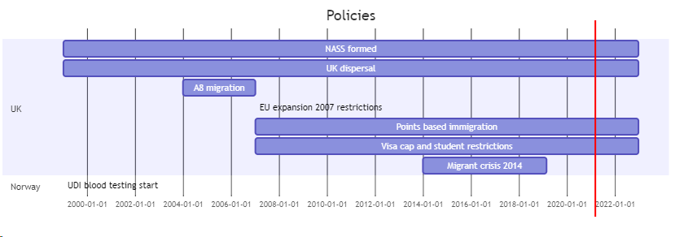

# Policy and major events

---
Code in mermaid for image timeline

See [here](https://mermaid-js.github.io/mermaid/#/)

```
gantt
    title Policies
    dateFormat  YYYY-MM-DD
    section UK
    NASS formed           : 1999-01-01, 2023-01-01
    UK dispersal           : 1999-01-01, 2023-01-01
    A8 migration: 2004-01-01, 2007-01-01
    EU expansion 2007 restrictions:  2007-01-01,
    Points based immigration: 2007-01-01, 2023-01-01
    Visa cap and student restrictions: 2007-01-01, 2023-01-01

    Migrant crisis 2014: 2014-01-01, 2019-03-01

    section Norway
    UDI blood testing start: 1999-01-01,

```
Need to add to live editor and save as image!



----

##  1948
**UK**: British Nationality Act.
- Introduced common imperial citizenship
- Allows British passport holders to travel to UK
- Allowed dual citizenship
- Start of arrival from SE and Carribean (windrush generation 1948-1970)


##  1951
**ALL** UN refugee convention. All Nordic countries and UK signed it.

##  1975
**Sweden**: Overturning of assimilation policies in favour of state-sponsored multiculturalism.

##  1985
**Sweden**: Start of dispersal policy.

##  1986
**Denmark**: First dispersal act. Arriving refugee populations dispersed across 13 Danish countries.

##  1990s
**ALL**: Refugee influx due to Balkan crisis.

##  1998
**Denmark**: Dispersal legislation - tied immigrant introductory programs and welfare benefits to residing in their assigned municipality in order to discourage relocation.


## 1999
**UK**: NASS formed
**UK**: Start of migrant dispersal policy
**Norway**: UDI starts blood testing on somalis who apply for family reunification.

## 2001
**Denmark**: New gov 2001-2003 adopted more regulations on family immigration
- 24 year rule: Spouses must be > 24
- family reunification will only be granted if the married couple has a national attachment to Denmark that is considered to be greater than that to any sother country
- More difficult to be refugee
**Denmark**: 300/450-hour rule - occupational employment determined cash benefits for all

**Sweden**: Dual citizenship accept. No language requirements.


##  2004
**ALL**: EU expansion to include A8 nations. Norway subject to EEA allow migration.

**UK**: A8 migrants need to register with Worker's registration scheme (WRS) within 30 days of finding a job. Limited access to benefits?

##  2006
**Norway**: Citizenship act calls for language requirements and citizenship ceremony/oath of allegiance (voluntary)

##  2007
**EU**: Second EU expansion including Bulgaria and Romania.

**UK**: Imposes more stringent condition for second expansion migrants.

##  2008
**Norway**: Language requirements finally implemented for citizenship.

**Sweden**: Proposition 2008 enacted. More liberalised policy towards getting residency permits.

**UK**: Start phasing in points based migration system for non-EEA migrants.
**UK**: Cap on visas to non-EU for work
**UK**: Reforms to route for international students. Bid to reduce entry to study in UK.


##  2009
**Norway**: Formation of Welfare and Migration Committee (Velferds- og migrasjonsutvalget): describe and assess impact of immigration on welfare. Final report 2011. Headed by Brochmann.

**Sweden**: 2009 Malmo anti-israel riots.


##  2010
**Sweden**: Proposition 2010.  Modest financial support requirement for reunification. Still incredibly liberal.
**Sweden**: 2010 Rinkeby riots


**Norway**: Tightening of family immigration law. Higher income for under 23s (refugee exempt)

##  2011
**EU**: End of transitional restrictions on A8 migrants in other EU countries.

##  2013
**Sweden**: 2013 Stockholm riots


## 2014
**ALL**: Migrant crisis related to Syria and continuing issues in Somalia and Eritrea.

**Norway**: Citizenship exam added (1 March). Must pass for citizenship.

## 2015
**ALL**: Migrant crisis related to Syria and continuing issues in Somalia and Eritrea.

**Sweden**: Massive asylum seeker influx peaking in Autumn.

**Denmark**: Dual citizenship allowed

##  2016
**Sweden**: Short term restriction on entry due to influx. Border ID controls in effect during year. Large drop-off in applications.


##  2020
**Norway**: Dual citizenship allowed
