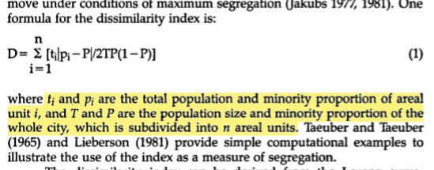
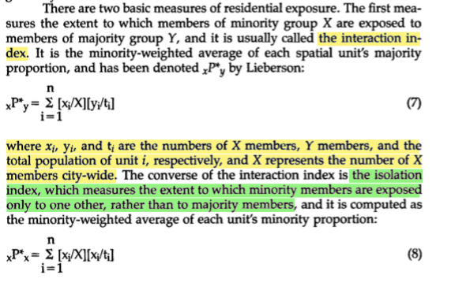
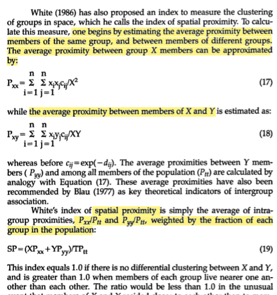
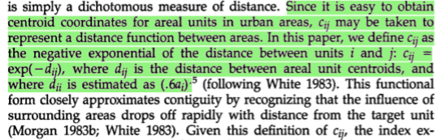
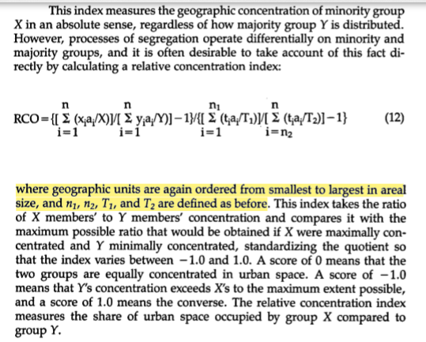
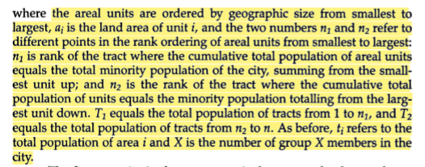
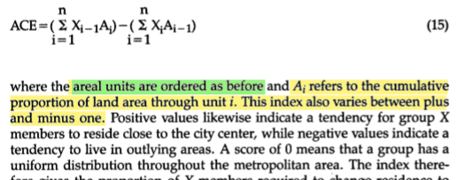
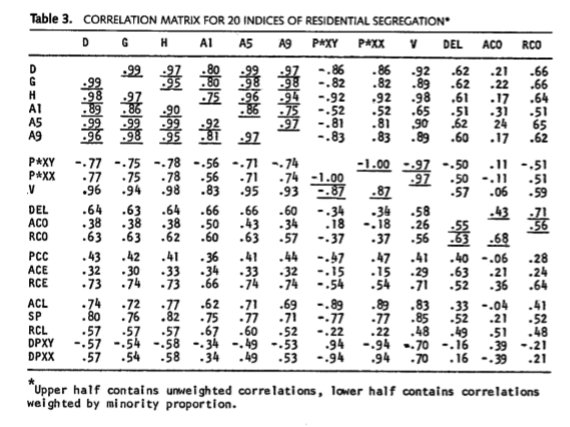
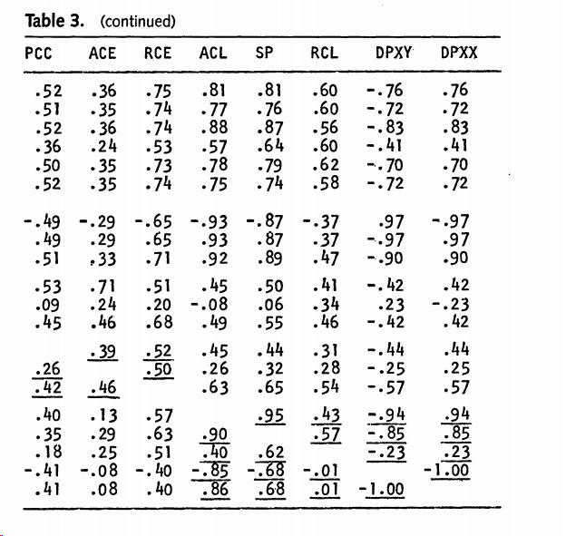
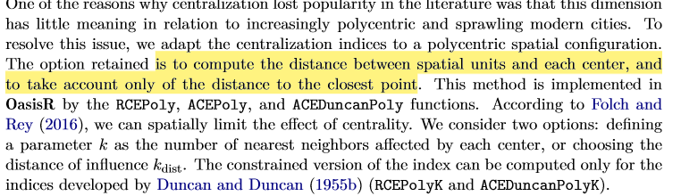

# This is notes related to a replication of the Denton and Massey papers

**Goal**: Run all the segregation indices for segregation plus the index of frontier-ness to judge whether it is actually distinct.

##  What is segregation
> At a general level, residential segregation is the degree to which two or more groups live separately from one another, in different parts of the urban environment (@massey 1988, p. 282)

^ Above from the 1988 paper

##  Massey's reflection on their work (2012)

> Massey, Douglas S. 2012. ‘Reflections on the Dimensions of Segregation’. Social Forces 91 (1): 39–43.

> Nancy Denton and I published “The Dimensions of Residential Segregation” in 1988, during the early phases of a multiyear project funded by the National Institute of Child Health and Human Development. The purpose of the project was to study the trends, patterns, causes, and consequences of racial and ethnic residential segregation the United States. Nancy was a postdoctoral research associate on the study at the time we began our investigation. In starting out, we encountered a vigorous debate in the literature about the “correct” or “right” way to measure neighborhood segregation that left us unsure about how to proceed methodologically.
> By the mid-1980s no consensus had been reached on how best to measure segregation and we uncovered some 20 different measures of the concept in our review of the literature. Before proceeding to the substance of our analysis, we decided we had to bring some order to the debate and so undertook a systematic analysis of segregation indices, resulting in the Social Forces paper.

Note: Useful synopsis -- very relevant to our position. Basically when they began their project on segregation there was loads of segregation indices. So one of the first pieces of work they undertook was to clear the field by looking at the correlation between the indices. Their conclusions was to classify segregation in five dimensions:

> We began by conceptually classifying measures with respect to five distinct dimensions of spatial variation: unevenness, exposure, clustering, concentration and centralization. **Unevenness** is the degree to which the percentage of minority group members within specific neighborhoods departs from the minority percentage in the entire urban area. **Exposure** is the degree of potential contact (or lack thereof) between minority and majority members within particular neighborhoods. **Clustering** is the extent to which minority neighborhoods adjoin one another in space. **Concentration** is the relative amount of physical space occupied by a minority group within a city; and **centralization** is the degree to which minority members settle in and around the social or geographic center of a metropolitan area.

Their preferred measures for each were:
1. the dissimilarity index for unevenness;
2. the P* index for exposure;
3. the spatial proximity index for clustering;
4. the relative concentration index for concentration; and
5. the absolute centralization index for centralization.

### Hyper-Segregation
Basically they found that Black and later Hispanic groups were very segregated based on 4 of the 5 indices which led to their idea of hyper-segregation.

In the context of **social mobility**; hypersegregation limits spatial mobility (as minorities settle near other minorities) and thus opportunities for social mobility (e.g. better schools ?!)

> ...  We then undertook this exercise for Blacks, Asians and Hispanics in 1980 and found that African Americans were the only minority group to experience high levels of segregation on at least four of the five dimensions of segregation simultaneously, indicating a unique pattern of intense spatial isolation that we labeled “hypersegregation” (Massey and Denton 1989). Although African Americans were the only group to experience hypersegregation in the 1980s and 1990s, by 2000 Hispanic communities in two metropolitan areas (Los Angeles and New York) had evolved to satisfy the criteria for hypersegregation (Wilkes and Iceland 2004).

> ... American Apartheid (Massey and Denton 1993). In the book, we described how residential segregation perpetuated Black disadvantage by concentrating neighborhood poverty and severing the link between social and spatial mobility that other groups historically had used to work themselves up the socioeconomic hierarchy over time.

Continuing methodological debates really about whether to accept clustering as a separate dimensions ?!

> Methodological debates about the measurement of segregation continue, of course, with the main issue being whether it is preferable to adjust segregation measures for spatial clustering or to measure clustering as a separate dimension (Reardon and O'Sullivan 2004).

## The optimal indices for each dimension?:
Taken from

> Massey, Douglas S., and Nancy A. Denton. 1988. ‘The Dimensions of Residential Segregation’. Social Forces 67 (2): 281–315. https://doi.org/10.1093/sf/67.2.281.

1. Dissimilarity index

2. P* indices for exposure

Note: Ranges from between 0 and 1. Both indices are recommended to be reported (p. 308)

3. Spatial Proximity index

Note: c here is a distance function explained in the previous page:

Note: Above ignore the last line re: distance between person i and themselves. Exp(0) is 1. Use distance in **km** just to sort out issues re: exp(-1000) being tiny (and too close to zero after some calculation for the computer)

4. Relative concentration index

From the relevant pages that showed the absolute concentration index:

5. Absolute centralisation index

Where ordering is i = 1 is zone nearest to city centre; X is cumulative proportion of a group living with the i closest zones to the city cenre.

Real toss up between this and RCI mind

## Correlation between indices

So indices that are basically terrible have

## R Packages for Segregation
OasisR!!! Which actually in parallel proposes the SAME polycentric RCI measure as Zhang and Pryce 2019.

> Tivadar, Mihai. 2019. ‘OasisR : An R Package to Bring Some Order to the World of Segregation Measurement’. Journal of Statistical Software 89 (7). https://doi.org/10.18637/jss.v089.i07.

See page 12:

