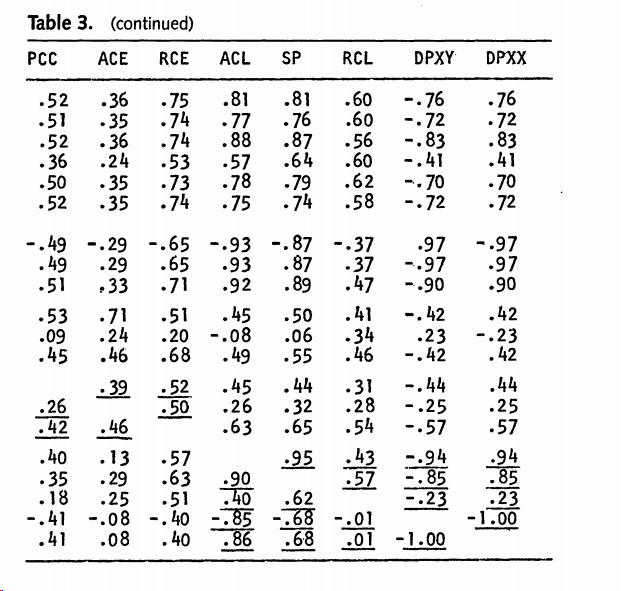

# Frontiers and segregation indices

Title: *Are aggregate measures of social frontiers/ boundaries a dimension of residential segregation?*

<!-- TOC titleSize:2 tabSpaces:2 depthFrom:1 depthTo:6 withLinks:1 updateOnSave:1 orderedList:0 skip:0 title:1 charForUnorderedList:* -->
## Table of Contents
* [Frontiers and segregation indices](#frontiers-and-segregation-indices)
* [Overview](#overview)
* [Background](#background)
* [The idea of frontier-ness](#the-idea-of-frontier-ness)
* [Measuring frontier-ness](#measuring-frontier-ness)
  * [Data](#data)
    * [Sweden](#sweden)
    * [Norway](#norway)
* [Methods](#methods)
  * [Results](#results)
<!-- /TOC -->


#  Overview

Boundary areas where two distinct residential communities meet are potential areas of both social conflict and cooperation (@dean 2016, @legewie 2016). Boundaries can be sharp: one community can abruptly end where another begins. Boundaries can also be fuzzy if the edges of two communities are hard to distinguish due to social mixing at peripheral areas. Evidence on whether fuzzy or sharp areas are associated with conflict or cooperation are mixed (@dean 2016, @legewie 2016). Aside from their micro-spatial effects, the overall presence of social boundaries could constitute a separate dimension of segregation. This paper assesses the degree to which aggregate measures of **sharp boundary** boundaries (henceforth known as **frontier-ness**in an urban area actually constitutes a separate dimension of segregation. We discuss what frontier-ness might mean and empirically assess it as a dimension of segregation using a method based on Denton and Massey's work (@massey 1988).

---

# Background

> At a general level, residential segregation is the degree to which two or more groups live separately from one another, in different parts of the urban environment (@massey 1988, p. 282)

Since segregation studies began, there have been many proposed indices for measuring segregation. In 1955, Duncan and Duncan (@duncan 1955) published a landmark paper showing how common segregation indices at that time were mathematically related. Functionally related indices were informationally redundant and could be summarised by one general segregation index. Duncan and Duncan proposed the dissimilarity index (henceforth DI). In the 1970s, the debate regarding measures of segregation reignited leading to the proliferation of other indices. This lead to vigorous debates regarding the 'correct' way of measuring segregation. New indices were proposed to measure different distributional attributes of segregation not captured by the DI, such as spatial proximity and clustering. Furthermore, several indices were proposed to measure each index. This is the situation in which Nancy Denton and Douglas Massey found themselves in the late 1980s at the start of a funded project into residential segregation in the US (@massey 2012, p39). Unlike in 1955, no one had conclusively demonstrated that these new indices were redundant due to their mathematical properties.

As a solution, Denton and Massey proposed five dimensions of segregation that were:

1. Conceptually distinct in terms of the idea they were trying to capture
2. Empirically distinct based on an examination of correlation structures

The former can be seen as the abstract idea or 'plain language' explanation of what a dimension of segregation actually is rather than how it can be measured. For instance, this section's opening quote explains segregation itself in terms of degrees of separation between groups.  

The latter examines the extent to which we can determine the distinctness of each dimension. Pure introspection alone is unlikely to yield any conclusions about segregation or its dimensions (unless we can prove mathematical dependency, @duncan 1955). Segregation itself is an abstract concept with no naturally determinable scale that nonetheless has a bearing on (or is at least related to) other phenomena in the world. The issue of how to best measure abstract concepts is not new in the social sciences. There are strong parallels in research design in Massey and Denton's paper and the mainstream research paradigm in psychology that goes far beyond their choice of statistical analysis (factor analysis).

The rest of this note examines the extent to which frontier-ness is a separate dimension of segregation based on the two criteria mentioned above. The following sections discuss what constitutes the idea of frontier-ness and what appropriate indices could be used to measure it. Then we explain how we can empirically examine whether it is a distinct dimension of segregation.

---

# The idea of frontier-ness

> We began by conceptually classifying measures with respect to five distinct dimensions of spatial variation: unevenness, exposure, clustering, concentration and centralization.
  - **Unevenness** is the degree to which the percentage of minority group members within specific neighborhoods departs from the minority percentage in the entire urban area.
  - **Exposure** is the degree of potential contact (or lack thereof) between minority and majority members within particular neighborhoods.
  - **Clustering** is the extent to which minority neighborhoods adjoin one another in space.
  - **Concentration** is the relative amount of physical space occupied by a minority group within a city; and
  - **centralization** is the degree to which minority members settle in and around the social or geographic center of a metropolitan area.

  > (@massey 2012, my emphasis and formatting)

Frontiers are sharp boundaries between communities. As mentioned before, in this note, we leave aside the issue of measurement and validation. No one has proposed a definition of frontier-ness in the literature. Still, presumably, a tentative definition is the **degree to which there are distinct, separate borders between adjoining neighbourhoods where minority and majority groups settle**.

From the tentative explanation, it seems that frontier-ness overlaps with unevenness and clustering. The overlap between unevenness and frontier-ness occurs because in an urban area with equal shares of minority groups in every neighbourhood (e.g. no unevenness), there are also no frontiers (e.g. due to no minority neighbourhoods). However, other dimensions of segregation also share the same relation to unevenness: no unevenness leads to no clustering, concentration or centralisation. The overlap between clustering and frontier-ness occurs because  more adjoining minority neighbourhoods leads to less possibility of adjoining minority neighbourhood and other types of neighbourhoods (majority or mixed minority-majority).

Overlaps in the definition do not necessarily mean that two dimensions are not distinct (or distinct enough). However, based on introspection alone, we can anticipate some correlation between clustering, unevenness and frontier-ness. To this end, we turn towards an empirical analysis of segregation using a measure of frontier-ness and other segregation indices.

----

# Measuring frontier-ness

No existing measures of frontier-ness exists at the aggregate level (e.g. at city level). However, potential measures of frontier-ness include:

1. the proportion of minority groups that live near Frontiers (FI1; propForFrontiers)
2. the proportion of majority groups that live near Frontiers (FI2; propNatFrontiers)
3. the proportion of borders that are Frontiers in an urban area (FI3; propFrontiers)

Indices FI1 and FI2 bear resemblance to existing indices of segregation which are always weighted by population whilst FI3 is not.

Like Denton and Massey, we can compare the correlation between these proposed indices of segregation and other indices in widespread use. These indices are the ones preferred by Denton and Massey in their original paper (recapped in @massey2012):

1. the dissimilarity index for unevenness (DI);
2. the P* index for exposure (pxx and pxy);
3. the spatial proximity index for clustering (sp);
4. the relative concentration index for concentration (rco1 and rco2);

For now, we omit the indices of centralisation. We use data from Norway and Sweden to estimate segregation. The segregation indices are estimated for each urban region. In all cases, segregation is calculated by comparing native-born residents with foreign-born residents (including children of foreign born residents in the cast of Norway).

##  Data

Almost all segregation index data is calculated using aggregated areal unit data. The format varies across the two countries. There is a common definition of urban region in Nordic countries, agreed upon in the 1960s:

> An urban area is a densely populated area. An urban area is defined in Denmark , Finland , Norway , Iceland and Sweden as a contiguous area with at least 200 inhabitants where the distance between the houses is less than 200 meters.

In practise, each country deviates in its definition and methodology, but the core definition of the urban area has been unchanged since its inception. Urban areas are known as Tätort in Sweden (locality in English) and Tettsted (urban settlement). Each urban area is constructed with no regards to existing administrative borders or other statistical areas. This means that other areal can overlap urban area borders.

**@TODO Note** Current results use Norwegian municipality.
**@TODO Note** English has a similar definition called built up urban areas.

### Sweden

Swedish urban area is defined by Tatorter (2018 definition). Areal unit data is available at Deso level and population data in 2020.

### Norway

Areal unit data is available at Grunnkrets with population data from 2018.

**@TODO Note** Delområde level social frontiers are basically the same. Delområde is, however, the more 'natural' neighbourhood unit: statistics Norway created Delområde from existing geographies (e.g. parishes, school districts) and spilt these into Grunnkrets later.

# Methods

For each country, we calculate a set of social frontiers as in @dean2018. We use the entire country in the calculation and select frontiers that are substantial ($\Delta\Phi$ > 1.96 SD). For the calculation of other segregation indices we reference the @massey1988 paper as well as the oasisR package.

For social frontiers, we omit borders connecting each urban areas to the surrounding countryside (or other urban areas). Urban areas with less than 20,000 residents are omitted from the analysis. In total, this leaves us with a sample of 57 and 77 urban areas in Norway and Sweden, respectively.

Initially, we only consider the rank correlation between different indices of segregation.

##  Results

```
Rank correlation amongst segregation indices across Sweden and Norway (> 20k pop)
========================================================================================================
                 propFrontiers propNatFrontiers propForFrontiers   di    pxx    pxy     sp    rco1  rco2
--------------------------------------------------------------------------------------------------------
propFrontiers          1                                                                                
propNatFrontiers     0.838            1                                                                 
propForFrontiers     0.831          0.954              1                                                
di                   0.668          0.725            0.807         1                                    
pxx                 -0.518          -0.479           -0.468      -0.469   1                             
pxy                  0.518          0.479            0.468       0.469    -1     1                      
sp                   0.719          0.721            0.797       0.897  -0.727 0.727    1               
rco1                 0.402          0.463            0.534       0.622  -0.160 0.160  0.528    1        
rco2                -0.392          -0.460           -0.530      -0.614 0.132  -0.132 -0.510 -0.995  1  
--------------------------------------------------------------------------------------------------------
di = uneveness; pxx + pxy = exposure; sp = clustering; rco1 + rco2 = concentration      
```

We can observe strong correlation between the three frontier indices (propFrontiers, propNatFrontiers, propForFrontiers). This is entirely expected. The three frontier indices also have strong correlations with unevenness (di) and clustering (sp) (> 0.7).


```
Rank correlation amongst segregation indices across Sweden and Norway (> 40k pop)
========================================================================================================
                 propFrontiers propNatFrontiers propForFrontiers   di    pxx    pxy     sp    rco1  rco2
--------------------------------------------------------------------------------------------------------
propFrontiers          1                                                                                
propNatFrontiers     0.777            1                                                                 
propForFrontiers     0.782          0.891              1                                                
di                   0.549          0.548            0.737         1                                    
pxx                 -0.404          -0.325           -0.278      -0.447   1                             
pxy                  0.404          0.325            0.278       0.447    -1     1                      
sp                   0.585          0.485            0.673       0.888  -0.680 0.680    1               
rco1                 0.337          0.402            0.477       0.412  -0.050 0.050  0.304    1        
rco2                -0.342          -0.408           -0.478      -0.409 0.040  -0.040 -0.296 -0.996  1  
--------------------------------------------------------------------------------------------------------
di = uneveness; pxx + pxy = exposure; sp = clustering; rco1 + rco2 = concentration      
```

We can further the restrict the data to urban areas over 40,000. This leaves us with 56 urban areas in total (21 in Norway and 35 in Sweden). This restriction weakens the association between frontier indices and other indices of segregation.

For reference here is the original results from @massey1988 regarding correlation between segregation indices in the US. As noted in their paper; it is not uncommon for there to be considerable correlation between  different dimensions of segregation.



