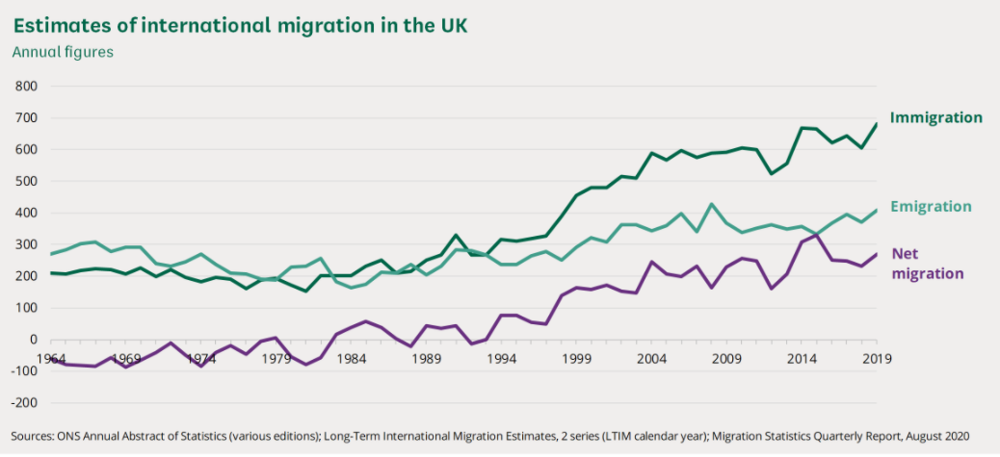

# UK migration

<!-- TOC titleSize:2 tabSpaces:2 depthFrom:1 depthTo:6 withLinks:1 updateOnSave:1 orderedList:0 skip:0 title:1 charForUnorderedList:* -->
## Table of Contents
* [UK migration](#uk-migration)
  * [Link to Nordic migration](#link-to-nordic-migration)
  * [British migration 1800 to present [Panayi 2013]](#british-migration-1800-to-present-panayi-2013)
  * [United Kingdom, Migration 1990s to Present [Robinson 2013]](#united-kingdom-migration-1990s-to-present-robinson-2013)
    * [Key migration events](#key-migration-events)
    * [Future issues](#future-issues)
  * [Migration stats (2020) [House of commons research brief]](#migration-stats-2020-house-of-commons-research-brief)
    * [Number of non-UK born migrants in UK](#number-of-non-uk-born-migrants-in-uk)
<!-- /TOC -->

## Link to Nordic migration
[See this file](nordic-migration.md)

##  British migration 1800 to present [Panayi 2013]

> Panayi, Panikos. 2013. ‘Britain, Migration, c.1800 to Present’. In The Encyclopedia of Global Human Migration, edited by Immanuel Ness, wbeghm078. Oxford, UK: Blackwell Publishing Ltd. https://doi.org/10.1002/9781444351071.wbeghm078.

Same type of encyclopedia article as those for Sweden/ Norway.

**Summary**: Unlike the Norway and Sweden articles from the same Encyclopedia. This one is very broad brush. So let's note some key facts

One reason for British immigration is due to its economy (first industrial nation in 19C):

Pre 1960s is quite interesting policywise due to apparently liberal migration laws:
> A second underlying factor that has facilitated migration on a large scale to Britain since 1800 has been a relatively **liberal immigration policy, despite the tough talk of politicians since the 1960s**. Indeed, for much of the 19th century Britain did not have any immigration laws. This changed with the Aliens Act of 1905, which essentially controlled the entry of Europeans and meant that the scale of migration declined to some extent, although this ignores the 240,000 Belgian refugees in World War I.

An important piece of legislation seems to have been this below:
> In 1948 the British Nationality Act, aimed at constructing a standard imperial citizenship, allowed up to 800 million people who now held a British passport to enter Britain, which acted as the background factor for the arrival of people from South Asia and the Caribbean.

**Note:** So is this conntected to the 'windrush generation?' From wikipedia itself:
> Between 1948 and 1970, nearly half a million people moved from the Caribbean to Britain, which in 1948 faced severe labour shortages in the wake of the Second World War. The immigrants were later referred to as "the Windrush generation".

So probably!! I think they were encouraged to migrate to UK.

From 1948 onward:
> There followed new immigration legislation during the 1960s in order to control the movement of people perceived as having the wrong skin color, from former British imperial possessions. New migrations would emerge in the later 20th and early 21st centuries. These included refugees from all over the world, who could claim asylum because Britain had signed the 1951 Refugee Convention. At the same time, Britain’s membership of the European Union has meant free movement of labor, resulting in the arrival of millions of people in the country since the 1970s.

Degree of migrant born **Take with pinch of salt as unsourced**:
> In 2004, 10 percent of employees in Britain were born in another country, a figure that excludes the descendants of migrants. In contemporary Britain, while government data  are unavailable, as much as 20 percent of the  workforce may consist of first-, second-, and third-generation immigrants.

**Note**: Again unsourced; this would mean in 2004 Foreign born migrants prop was less than that of Sweden. Not sure that is true.

Rest of article is about cultural influence and really is less academic and fact laden. Stop here.

## United Kingdom, Migration 1990s to Present [Robinson 2013]

Another encyclopedia entry in same place as Panayi 2013. More recent events focussed but also quite lightweight:

> Robinson, David. 2013. ‘United Kingdom, Migration 1990s to Present’. In The Encyclopedia of Global Human Migration, edited by Immanuel Ness, wbeghm556. Oxford, UK: Blackwell Publishing Ltd. https://doi.org/10.1002/9781444351071.wbeghm556.

So the rational for this period is the migration pattern is quite interest:

> Between 1997 and 2010 more than six million people migrated to the UK and annual net migration consistently topped 150,000 people per year. This “new migration” proved larger in scale and more diverse in nature than any previous migration to the UK.
> The UK has experienced a steep increase in migration over the last 20 years. **Average annual net migration between 1991 and 1999 was 65,000. Between 2000 and 2009 average annual net migration was 187,000 (Vargos-Silva 2011).** Official estimates suggest that 5.5 million longterm international migrants settled in the UK between 2001 and 2009. More than 80 percent of these people were non-British nationals.

^ Interesting above. What are the drivers?

### Key migration events

**Note** Since this is a secondary source - take it with a pinch of salt.

Asylum seeker...
> An important early driver of the increased number of migrants to the UK was the rising number of people applying for asylum. Asylum applications (excluding dependents) rose from 4,256 in 1987 to a peak of 84,130 in 2002, before declining to 17,790 in 2010 (Blinder 2011).

Migrant work and especially A8 accession ...
> Another important driver was the rising number of migrant workers arriving in the UK. Between 2000 and 2006, 2.5 million foreign nationals – 1.2 million from within and 1.3 million from outside the European Union (EU) – entered the UK and were allocated a National Insurance number (NINo), a requirement to work in the formal labor market (DWP 2008).

... and students!
>  A third factor underpinning the rise in migration was the large number of people coming to the UK to study. By 2009 this group accounted for 37 percent of all migrants to the UK (ONS 2010).

In constrast to migration from Carribean and India due to empire (which still happens).

Place where new migrants settle include London and other metropolitan areas -- but also different towns. Drawn perhaps by work in agriculture and hospitality.

**Asylum policy** This topic is quite an issue in the UK:
> Stung by criticism that it was failing to secure the border and manage the inflow of foreign nationals, the UK government introduced no less than seven parliamentary Acts on asylum and immigration between 1997 and 2009. The stated aim was to tackle abuse of the asylum system by people thought to be economic migrants but who were claiming persecution.

On **A8** accession policy; UK is one of three EU15 (old EU members) to have basically unrestricted access:

> Whereas the other EU-15 member states maintained work-permit systems for nationals from these countries for up to seven years after their accession to the EU, **the UK merely required accession state nationals to register with the Worker’s Registration Scheme (WRS) within 30 days of finding a job.**

**Note** That I think due to lack of benefit AND MAYBE a requirement to have had work in last 12 months.. non-working migrants left. See my A8 accession notes.

Taking a pinch of salt due to the secondary source; this seems a good synposis politically about what happened:

> Local service providers, including the police, schools, and local authorities, voiced concerns about the challenge of resourcing and delivering services in the face of the rapid population change and increasing diversity driven by all forms of migration. Intensifying competition for scarce resources was also reported, contributing to rising tensions and “cohesion challenges” in some locations. These debates coalesced around the issue of housing, with the chair of the Equality and Human Rights Commission observing that the perception that migrants are unfairly advantaged in the allocation of social housing was one of the most frequently alleged injustices of new immigration. The Far Right, recognizing an opportunity to secure significant political capital by tapping into latent fears about material loss endured by the resident population in the face of new immigration, propagated these concerns to great effect, securing increasing authority in the public debate about immigration and making major gains in local elections. Sections of the press soon joined the fray and began running stories about the social costs of migration and the material loss suffered by the resident population. New migrants emerged as a blameworthy group scapegoated for various social ills, from the shortage of affordable housing to the overstretched National Health Service.

^ All the above led to Gov taking this into policy.

> In an attempt to show it was listening to people’s concerns, the government committed itself to pay greater attention to the social costs of migration when forming policy. The first evidence of this new approach was the decision to place far more stringent conditions on the right of nationals from Bulgaria and Romania to work in the UK following their accession to the EU in 2007

Also below shows the introduction of a points based migration system and tightening on students:

> This involved the introduction of a new points-based system, designed to more effectively identify and attract the mi
  grants of most benefit to the UK, and the introduction of a cap (numerical limit) on the numbers of visas issued to non-EU migrants entering the UK for work. Reforms to the international student route into the UK were also introduced in a bid to reduce the number of people being granted entry to the UK to study.

**Note** Although this article mentions it; we will leave the actual evaluation of the pros and cons of migration elsewhere.   

###  Future issues

**Note:** This is interesting cause it is written in 2013 prior to Brexit.

Apparently in this section ('numbers game') he mentioned that opinion poll have always shown the UK public supports restrictions on migration.

He says the UK had little control over migrants due to EU but this obviously changes with Brexit:

> First, the UK government has no control over one of the largest groups of migrants arriving in the country. More than 40 percent of the nearly six million long-term international migrants who arrived in the UK between 1997 and 2008 (some 2.5 million people) were UK or EU citizens, who had the legal right to enter and settle in the country.

Another source is refugees:

> Second, when the UK ratified the 1951 Convention on Refugees it accepted a moral and legal duty to protect individuals who have fled persecution because of their race, religion, nationality, or membership of a particular social or political group.

**Note** I think the Syrian crisis really change the allocation of refugees though so he is also not 100% correct.

> Third, the government might slow down but cannot afford to turn  off the supply of foreign workers.

^ Probably true. And that's the end.

## Migration stats (2020) [House of commons research brief]

From house of commons library research brief:

> Sturge, Georgina. 2020. ‘Migration Statistics’. House of Commons Briefing Paper CBP06077. House of Commons Briefing Paper. https://commonslibrary.parliament.uk/research-briefings/sn06077/#:~:text=There%20are%20fewer%20foreign%20nationals,population%20is%20concentrated%20in%20London.

**Note:** The raw data for this report can also be downloaded.

Useful time series (originally ONS) of net migration. Really shows the growth in net migration:

**On non-UK citiziens** (not same as migrants):

> In the year ending December 2019:

>6.2 million people were living in the UK who had the nationality of a different country (9% of the total population),

> 3.7 million EU nationals were living in the UK, and

> 994,000 UK nationals were living in other EU countries excluding Ireland.

Studying makes up a huge chunk of those in UK:

> In the year ending March 2020, formal study was the most common main reason for immigration (36%), while work was the second most common main reason (32%).

Remember that the UK tried to cut down on students in the 2010s:

> Study was the most common main reason for immigration during the period 2009-12, and the reduction in the number of people migrating to the UK to study since then **reflects a reduction in the number of Tier 4 student visas issued to students from outside the EEA and Switzerland**. In 2018, study once again became the most common reason for immigration to the UK, according to the estimates.

**Note** ^ See the dip in the time series in the paper after 2009/10

### Number of non-UK born migrants in UK

> There are fewer foreign nationals living in the UK than there are people born in other countries. In 2019 there were approximately 6.2 million people with non-British nationality living in the UK and 9.5 million people who were born abroad.

**Note** ^ Quote below says 14% of UK born in another country. Which is similar to Sweden's stat. However this discounts children of immigrants; UK has a colonial migration history.

Below shows migrant pop is very uneven across UK:

> The UK’s migrant population is concentrated in London. Around **35% of people living in the UK who were born abroad live in the capital city**. Similarly, around **37% of people living in London were born outside the UK, compared with 14% for the UK as a whole**.

> After London, the English regions with the highest proportions of their population born abroad were the South East (13.4%), the West Midlands (13.9%), the East of England (12.9%), and the East Midlands (12.7%). In each of these regions the proportion of people born abroad was lower than for England as a whole (15.5%), which is skewed by London.

> Of all the nations and regions of the UK, the North East had the lowest proportion of its population born abroad (5.8%), followed by Wales (6.5%), Northern Ireland (7.0%), and Scotland (9.3%).

**Note**: Non-quotable stat based on wiki but London probably accounts for 14-15% of UK pop.

**Note:** Read more later -- only read the exec summary. Really useful.
