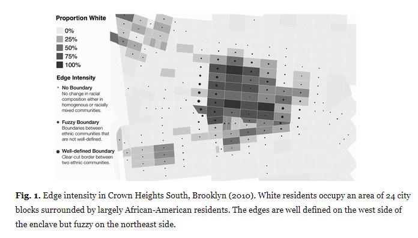
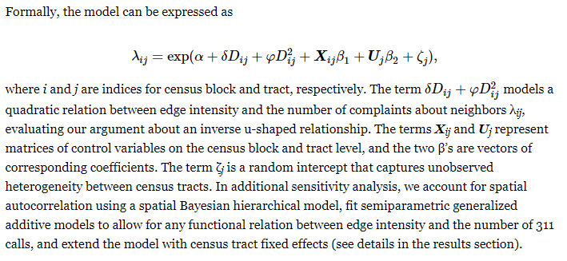
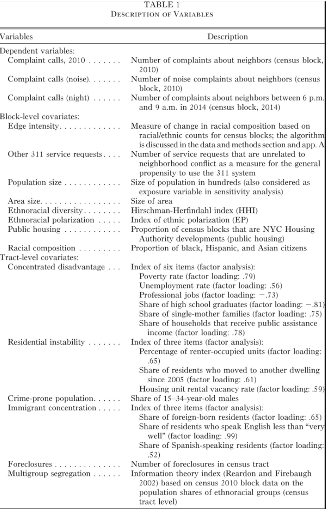
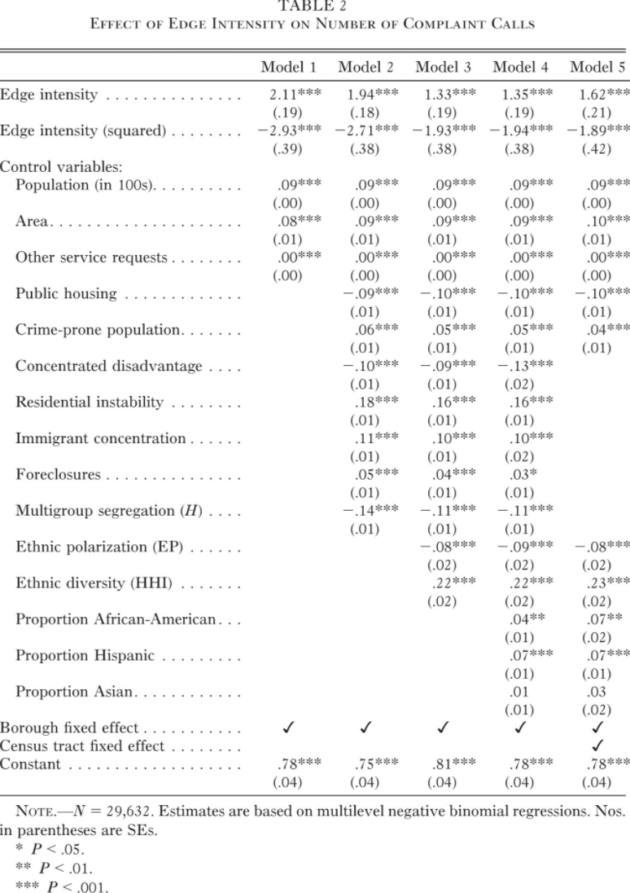

# Legewie and Schaeffer 2016

> Legewie, Joscha, and Merlin Schaeffer. 2016. ‘Contested Boundaries: Explaining Where Ethnoracial Diversity Provokes Neighborhood Conflict’. American Journal of Sociology, 37.

**Abstract**
> Concerns about neighborhood erosion and conflict in ethnically diverse settings occupy scholars, policy makers, and pundits alike; but the empirical evidence is inconclusive. This article proposes the contested boundaries hypothesis as a refined contextual explanation focused on poorly defined boundaries between ethnic and racial groups. The authors argue that neighborhood conflict is more likely to occur at fuzzy boundaries defined as interstitial or transitional areas sandwiched between two homogeneous communities. Edge detection algorithms from computer vision and image processing allow them to identify these boundaries. Data from 4.7 million time- and geo-coded 311 service requests from New York City support their argument: complaints about neighbors making noise, drinking in public, or blocking the driveway are more frequent at fuzzy boundaries rather than crisp, polarized borders. By focusing on the broader sociospatial structure, the contested boundaries hypothesis overcomes the “aspatial” treatment of neighborhoods as isolated areas in research on ethnic diversity.

Hypothesis: That conflicts occur at poorly defined borders; fuzzy AREAS sandwiched between homogenous communities

> They are contested because they threaten homogeneous community life and foster ambiguities about group rank. Above and beyond disorganization and diverging ways of life generally found in mixed neighborhoods, their location between differently populated homogeneous communities triggers hostility. Well-defined boundaries, by contrast, are accepted divisions between one group’s turf and another’s and are thus less contested.

They basically use machine imaging for edge detectio as well as to quantify the degree of fuzziness

> To measure edge intensity, we use edge detection algorithms from computer vision and image processing. These algorithms were developed in order to identify points in an image at which the image color or brightness changes sharply. Building on Legewie (2016a), we adopt and modify these methods so that they can be applied to neighborhood data, allowing us to detect the borders between homogeneous areas of different ethnoracial groups.

Example image below. For each zones, a value is given that defines the likelihood of being an edge or not (see dots)

Seems like these areas are also basically mixed ethnic neighbourhoods?

##  Why boundaries?

Inter-group mixing causes tensions? Threats by the outgroup. [intergroup competition]
... Or maybe mixing diminishes prejudice [contact theory]

> Based on ethnographic studies of white urban neighborhoods, this argument posits that their residents share a sense of community identity based on the exclusion of other ethnoracial groups. Building on these insights, Green, Strolovitch, and Wong (1998) show that racially motivated crimes are more likely to occur in homogeneous white areas that are confronted with in-migration of ethnoracial minorities (see also Lyons 2007; Grattet 2009).

Community erosion at fuzzy boundaries? Leading to crime etc

> According to the seminal study of the economists Alesina, Baqir, and Easterly (1999), the proportion of tax money spent on education, trash disposal, and welfare declines with increasing levels of ethnoracial heterogeneity in U.S. metropolitan areas. The debate began to receive widespread attention among sociologists and political scientists only after a study by Putnam (2007). He shows that a large number of good-community indicators suffer from ethnoracial diversity such as trust in neighbors, interest in volunteering, or work on community projects. Putnam’s findings about reduced trust in people of similar ethnicity in diverse neighborhoods situate his study in the tradition of disorganization theory and set the debate apart from the literature on intergroup competition. Aside from reduced social interactions and lack of social control, this line of research considers additional mechanisms that may explain the disintegrating consequences of ethnoracial heterogeneity: difficulties to balance numerous and diverse interests that reflect competing ways of life (Kimenyi 2006; Page 2008) and communication problems and potentials for misinterpretation (Habyarimana et al. 2007; Desmet, Ortín, and Wacziarg 2012).

[Next part is the literature on borders -- we can skip this]

## Data and methods

Data = basically geocoded data on request for 311 service in New York city in 2010 and 2014. It's basically like a non-emergency service:

> The 311 system is a centralized nonemergency telephone number, Internet platform, and smartphone application that allows city residents to file a request for or complain about issues as diverse as birth certificate services, fallen tree removal, or broken heating.

From later:

> When a person files a service request such as reporting a noisy neighbor through the 311 service hotline, website, or smartphone app, the person specifies the topic (e.g., “noise residential” featured prominently on the website and as an example on the hotline), provides further details based on a list of categories (e.g., “banging/pounding,” “loud music/party,” “loud talking,” or “loud television”), and indicates the time and place. After a request is filed, the information is forwarded to the appropriate city agency, such as the New York City Police Department, which responds to the complaint.

They focus on complaints about neighbours for neighbourhood conflict. This is whilst try to adjust for propensity to call 311 by using other complaint data.

> The 311 service requests allow us to track complaints about neighbors such as “loud music” or “illegal parking” as indicators of everyday neighborhood conflict across time and space

Complaints is a function of ethnic heterogeneity (social mix); polarisation AND then edge intensity.

### Edge detection

Also see [this page](edge-detection.md)

Uses edge detection but on census blocks (i.e. zonal data). Here's what they have to say on other techniques

> This literature includes various methods used in ecology, epidemiology, and other areas, such as “wombling” (Jacquez, Maruca, and Fortin 2000; Dale and Fortin 2014), or methods based on ecocentric signatures and cluster analysis (Logan et al. 2011; Spielman and Logan 2013). Most of the existing boundary analysis methods are designed for either point-specific data with known coordinates or regular lattices such as images (Nosrati et al. 2013; Dale and Fortin 2014).4

**Note** Most of how legwie changed the edge detection is in the appendix and a 2016 article. Seems like edge detection needs pixels and legwie used kernels to turn the polygon data to that format.

Their edge intensity metric is not 100% just a measure of ethnic heterogeneity but it's hard to understand:

> The modified edge detection algorithm allows us to detect racial and ethnic neighborhood boundaries on the basis of contemporary census data. In particular, **we first calculate edge intensity for each of the four ethnoracial groups separately [my edit: for each zone/pixel] and then multiply the values of the two groups with the highest edge intensity values**. As a consequence, changes in racial composition from one dominant group to a mixed neighborhood or between differently composed mixed areas get assigned lower values than transitions between two ethnically homogeneous areas (for a concrete example, see app. A). Low values indicate no change in ethnoracial composition. This is the case within both ethnoracially homogeneous and diverse areas as long as the composition of adjacent areas is the same. High values indicate abrupt changes from one ethnoracial group to another such as transitions from a predominantly African-American to a dominantly Hispanic area.

Here is their actual mix variable:

> Across the 29,655 inhabited census blocks in New York City, the average edge intensity is 0.08 (SD = 0.073). By definition, fuzzy edges are also ethnoracially mixed. But **our edge intensity measure is theoretically (see arguments above) and empirically distinct from heterogeneity (the correlation is .25).**

## model
Basically a negative binomial count model (avoiding overdispersion in poisson) with a random effect for census tracts (due to each census block being in a tract; basically SE issues):

> Our models include a number of control variables on the census block level. Most importantly, we adjust for the general propensity to call 311 using the number of service requests that are clearly unrelated to neighborhood conflict (see app. B). This variable adjusts for what Minkoff (2016) calls “contacting propensity.” The other variables on the census block level are the population size (in hundreds), the block’s area size, the proportion of the area that is covered by public housing, and the ethnoracial composition in terms of the proportion of black, Hispanic, and Asian citizens.

Full table:

**Note:** One of the control variable is a variable detailing other 311 calls as propensity. I don't think this is a potential collider so that is probably okay (but unobserved heterogenity still issue)

**note** why is population size not used as an offset for rate in this model? assuming it is like a poisson model.

**Note** Borough level fixed effects and census tract FE also included in one spec (same results)

## Results

The evidence for the U-shaped relationship comes from the significant quadratic term.

**Need to check sensitivity analysis**: Basically this contains a fair amount of remodelling and recoding to check.  
